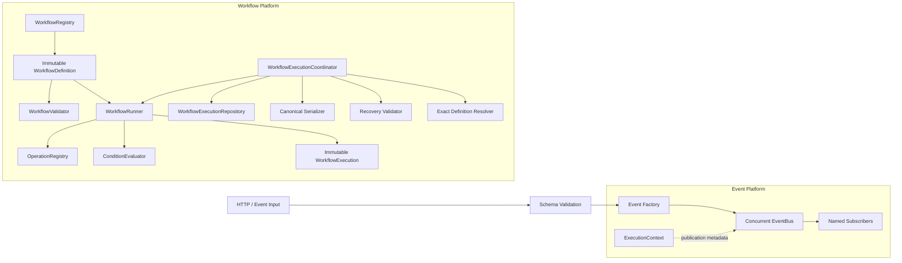
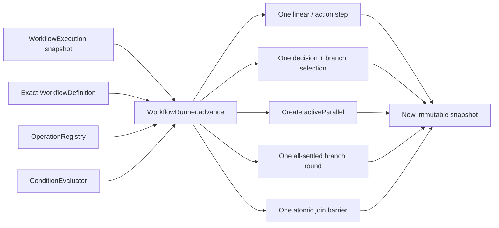
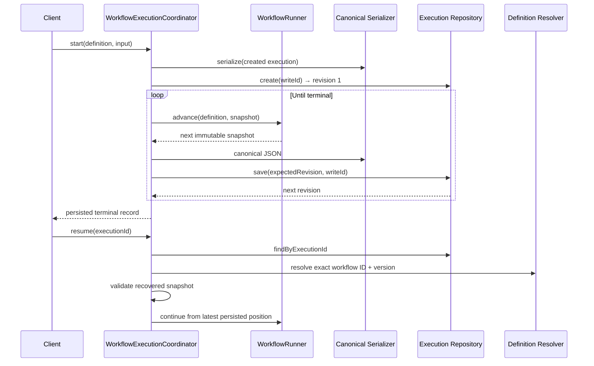
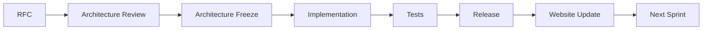
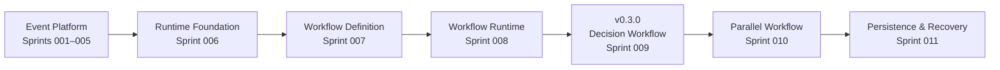

# VEP Studio

**A deterministic, event-driven workflow platform built around explicit contracts and immutable execution snapshots.**

[Project website](https://joyquadrasync.github.io/VEP-Studio/) · [Architecture](ARCHITECTURE.md) · [Roadmap](ROADMAP.md) · [v0.3.0 release](https://github.com/JoyQuadraSync/VEP-Studio/releases/tag/v0.3.0)

```text
Current product version  v0.3.0
Current platform stage   Persistent Workflow Platform
Completed sprints        11
Automated tests          69
Current milestone        Sprint 012 — Retry / Timeout / Dead Letter
```

VEP Studio connects typed events, declarative workflow definitions, deterministic runtime decisions, structured parallel regions, and persistence-ready execution recovery. The project is deliberately architecture-first: every capability moves through RFC, review, freeze, implementation, tests, and release.

> VEP Studio is under active development. Human Tasks, AI Agents, scheduling, and the Visual Workflow Designer are roadmap capabilities—not current features.

## Why VEP Studio

- **Explicit by default.** Workflow definitions, conditions, operations, failures, and persistence boundaries are represented by inspectable contracts.
- **Deterministic execution.** Branch selection and result ordering never depend on edge order, locale, Promise settlement timing, EventBus state, randomness, or mutable globals.
- **Immutable state.** Every runtime transition produces a new `WorkflowExecution` snapshot; supplied executions and histories are never mutated.
- **Persistence-ready lifecycle.** Canonical snapshots, optimistic revisions, exact definition-version recovery, and an in-memory reference repository establish a durable orchestration boundary. A process-durable database adapter is planned.
- **Clear ownership.** Runner owns control flow, Coordinator owns save-point timing, Repository owns storage, and EventBus remains outside workflow progression.

## Architecture

VEP Studio keeps event publication and workflow control flow as cooperating but independent systems.



EventBus does **not** advance workflow steps, evaluate conditions, select branches, coordinate parallel regions, or store workflow execution state.

## Runtime flow

`WorkflowRunner.advance()` is the single incremental progression API. `run()` is the backward-compatible in-memory convenience wrapper over the same semantics.



Parallel execution uses structured fork/join regions. Stable branch IDs determine canonical UTF-16 code-unit ordering. Branch histories remain local while parent history is flattened atomically at the join barrier.

## Persistence and recovery flow

Persistence is an opt-in application boundary; it is not embedded in Runner.



The repository uses optimistic revision control and per-execution `writeId` tracking. Stale writes never silently overwrite newer state. Handler execution is at least once, so operation handlers should be idempotent.

## Current capabilities

| Layer | Delivered capability |
|---|---|
| Event intake | Express HTTP boundary with schema validation |
| Event platform | Strongly typed events, factory, concurrent EventBus, named subscribers, failure isolation |
| Runtime foundation | ExecutionContext, Clock, PublishResult, SubscriberResult, stable identities |
| Workflow definition | Immutable versioned graphs, dotted IDs, validator and registry boundaries |
| Workflow runtime | Immutable snapshots, structured results and failures, sync/async operation handlers |
| Decisions | Declarative conditions, restricted references, default branches, deterministic selection |
| Parallel execution | Structured fork/join, all-settled branches, canonical ordering, retained region history |
| Persistence | Canonical JSON, optimistic revisions, duplicate-write protection, and an in-memory reference repository |
| Recovery | Exact definition-version resolution, persisted-snapshot resume, and active-parallel recovery orchestration |

### Condition language

The intentionally small declarative condition language supports:

```text
equals                 not_equals
greater_than           greater_than_or_equal
less_than              less_than_or_equal
exists                 not_exists
and                    or                    not
```

No callbacks, scripts, dynamic evaluation, regex, arithmetic, templates, environment access, network access, randomness, or time-dependent evaluation are allowed in definitions.

## Project structure

```text
VEP-Studio/
├── backend/
│   ├── src/
│   │   ├── event-bus/          concurrent publication
│   │   ├── events/             typed domain events
│   │   ├── router/             HTTP event routing
│   │   ├── runtime/            event-publication contracts
│   │   ├── schemas/            intake validation
│   │   ├── subscribers/        event subscribers
│   │   └── workflows/
│   │       ├── definitions/    immutable workflow definitions
│   │       ├── runtime/        runner, operations, conditions
│   │       └── persistence/    coordinator, repository, recovery
│   └── tests/                  Node test suites
├── docs/
│   ├── adr/                    architecture decisions
│   ├── architecture-review/    reviews and frozen contracts
│   ├── releases/               sprint and product releases
│   └── site/                   dependency-free GitHub Pages site
├── prompts/                    approved sprint implementation records
├── ARCHITECTURE.md
├── PROJECT_STATUS.md
├── ROADMAP.md
└── CHANGELOG.md
```

## Getting started

Requirements: Node.js 18 or later and npm.

```bash
cd backend
npm install
npm run typecheck
npm run build
npm test
```

Run the development server:

```bash
npm run dev
```

The default HTTP server listens on port `3000` unless `PORT` is set.

## Delivery model



This process has produced 11 completed sprints, seven accepted ADRs, sprint tags `sprint-001` through `sprint-011`, and 69 passing automated tests.

## Roadmap

```mermaid
flowchart LR
    S7[Sprint 007<br/>Definition] --> S8[Sprint 008<br/>Runtime]
    S8 --> S9[Sprint 009<br/>Decision]
    S9 --> S10[Sprint 010<br/>Parallel]
    S10 --> S11[Sprint 011<br/>Persistence & Recovery]
    S11 --> S12[Sprint 012<br/>Retry / Timeout / Dead Letter]
    S12 --> S13[Sprint 013<br/>Human Tasks]
    S13 --> S14[Sprint 014<br/>AI Agent Runtime]
    S14 --> S15[Sprint 015<br/>Visual Designer]

    classDef done fill:#12372f,stroke:#4fd1b5,color:#e8fff9
    classDef current fill:#123251,stroke:#67e8f9,color:#ecfeff
    classDef planned fill:#202638,stroke:#6b7280,color:#d1d5db
    class S7,S8,S9,S10,S11 done
    class S12 current
    class S13,S14,S15 planned
```



Planned capabilities are not described as implemented. See [ROADMAP.md](ROADMAP.md) for the maintained milestone record.

## Release timeline



Sprint tags record engineering iterations. Semantic product tags record curated product milestones. The current semantic product release remains **v0.3.0**.

## Documentation

- [Architecture](ARCHITECTURE.md) — system boundaries and execution lifecycle
- [Project status](PROJECT_STATUS.md) — capability and architecture-health dashboard
- [Roadmap](ROADMAP.md) — completed, current, and planned milestones
- [Changelog](CHANGELOG.md) — delivered capabilities by sprint and release
- [Architecture decisions](docs/adr/) — accepted architectural choices
- [Architecture reviews](docs/architecture-review/) — review findings and frozen contracts
- [Release notes](docs/releases/) — goals, verification, and limitations
- [Sprint prompts](prompts/) — approved scope and acceptance records

## License

A project license has not yet been published. Until one is added, repository contents remain subject to the repository owner's rights.
