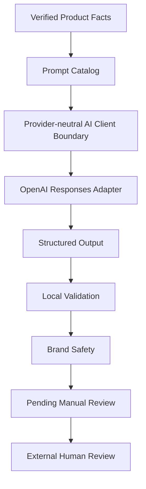

# Voluvia AI Content Engine Architecture

## Purpose

The Voluvia AI Content Engine turns verified product facts into constrained short-form content plans and scripts. Provider-generated data crosses explicit local validation and safety boundaries before it can become an output awaiting manual review.

## Architecture Flow



```text
Product Facts
      ↓
Prompt Catalog
      ↓
Provider-neutral AI Client Boundary
      ↓
OpenAI Responses Adapter
      ↓
Structured Output
      ↓
Local Validation
      ↓
Brand Safety
      ↓
Pending Manual Review
      ↓
Human Review
```

## Architectural Boundaries

### Product facts

Only validated semantic facts and explicitly enabled commerce facts are eligible for AI planning. Disabled facts are removed before the provider request and remain prohibited in validated output.

### Prompt Catalog

Prompts are resolved by stable ID and immutable integer version. Canonical hashes pin provider-visible content and preserve prompt history.

### Provider adapter

The provider-neutral AI client is an abstraction boundary between the Planner and Script operations and the concrete OpenAI adapter. It does not own prompt selection, business validation, brand safety, workflow progression, or persistence. The OpenAI adapter owns provider communication and returns only structured candidate data plus sanitized generation metadata.

### Structured output

The provider is constrained to the Planner's closed schema. Structured output limits shape and enum values, while local validation owns cross-field semantics.

### Local validation

Local validation enforces product facts, preferred and excluded selections, compatibility tables, scene rules, prompt identity, and JSON-safe output. Provider output that fails these rules does not become workflow output.

### Brand safety

Brand-safety rules prohibit unsupported medical, clinical, commercial, urgency, scarcity, guarantee, certification, and demographic claims. Prompt-injection instructions are ignored and must not be repeated or exposed.

### Manual review

Successful technical execution produces `pending_manual_review`; it does not constitute publication approval. Human review is currently an external manual responsibility. It is not yet implemented as a workflow Human Task.

## Runtime Boundary

WorkflowRunner continues to own workflow control flow. The AI adapter, Prompt Catalog, compatibility policy, and validators do not alter EventBus, ExecutionContext, persistence, or workflow-runtime contracts.

## Current Limits

The architecture currently has no TikTok data connector, publishing path, automatic repair, provider retry, Human Task, or closed-loop performance optimization.
