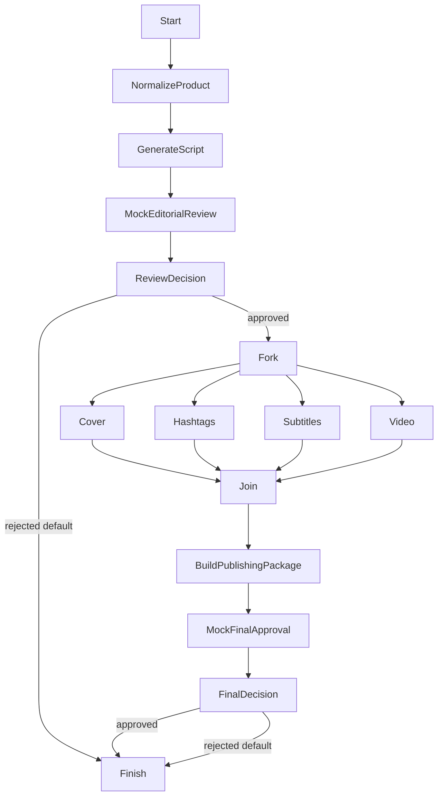

# Showcase Architecture

## Control flow

There is one shared finish. Its input envelope carries `disposition: "ready"` or `disposition: "rejected"`; rejected envelopes also identify the editorial or final rejection stage. Business rejection completes the workflow and is not a runtime failure.

## Data flow

Linear operations return newly constructed complete JSON-safe envelopes. The fork input is the approved editorial envelope. Each branch returns that explicit immutable continuation context plus one compact mock asset. The unchanged join contract returns canonically ordered `{ branchId, output }` entries.

`BuildPublishingPackage` resolves results by branch identity, validates stable asset IDs and discriminators, and requires every branch to carry semantically identical context. It does not reconstruct data from execution history or raw workflow input.

Branch ordering is the runtime's deterministic UTF-16 code-unit ordering: `cover`, `hashtags`, `subtitles`, `video`. It does not depend on edge declaration order, Promise settlement order, duration, or locale.

## Runtime boundaries

`WorkflowRunner` owns control flow. `WorkflowExecutionCoordinator` owns persistence orchestration and save-point timing. `OperationRegistry` resolves the nine showcase handlers. `ConditionEvaluator` evaluates the two existing declarative conditions. EventBus and its `ExecutionContext` do not participate.

The in-memory repository validates persistence, canonical serialization, revisions, write IDs, recovery validation, and same-process resume contracts. It does not survive process termination and is not a production database adapter.

## Determinism

Handlers use no network, filesystem writes, time, randomness, environment variables, EventBus state, or mutable globals. The same input produces the same JSON-safe business output. The `.srt` file is documentation extracted from the subtitle JSON string; workflow execution never writes it.
